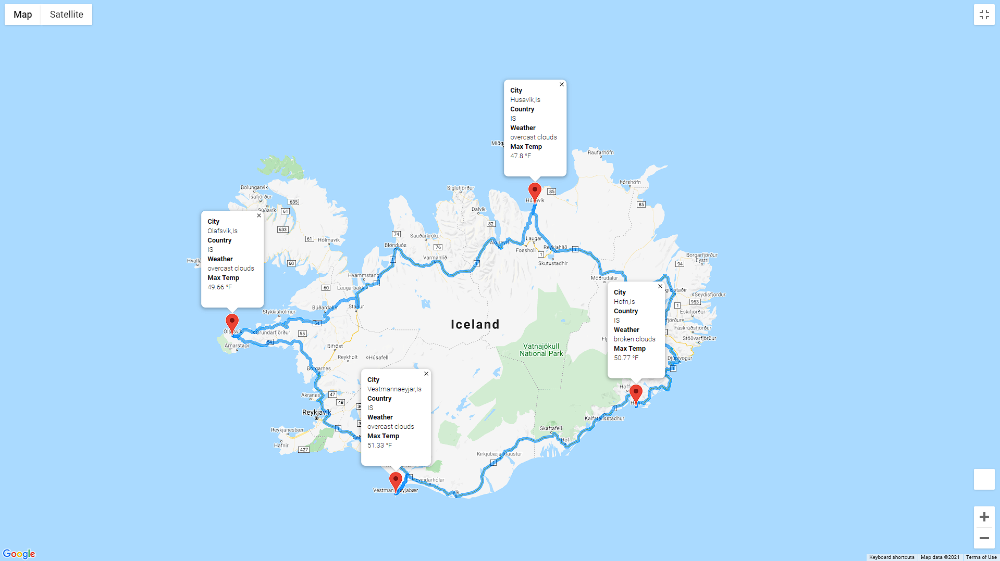

# World_Weather_Analysis
## Creating The Ideal 4-stop Vacation Itinerary
### Richard E Barber 2021
#### Data Analysis and Visualization

#### Purpose:
* Developement of API calls
    * [OpenWeatherMap](https://openweathermap.org/api)
    * Google Maps
        * [Places](https://developers.google.com/maps/documentation/places/web-service/search-nearby)
        * [Directions](https://developers.google.com/maps/documentation/directions/get-directions)
* Interactive Script
    * Customer Input

#### Example Output:

</img> 
Fig. 1, Four-stop loop itinerary
